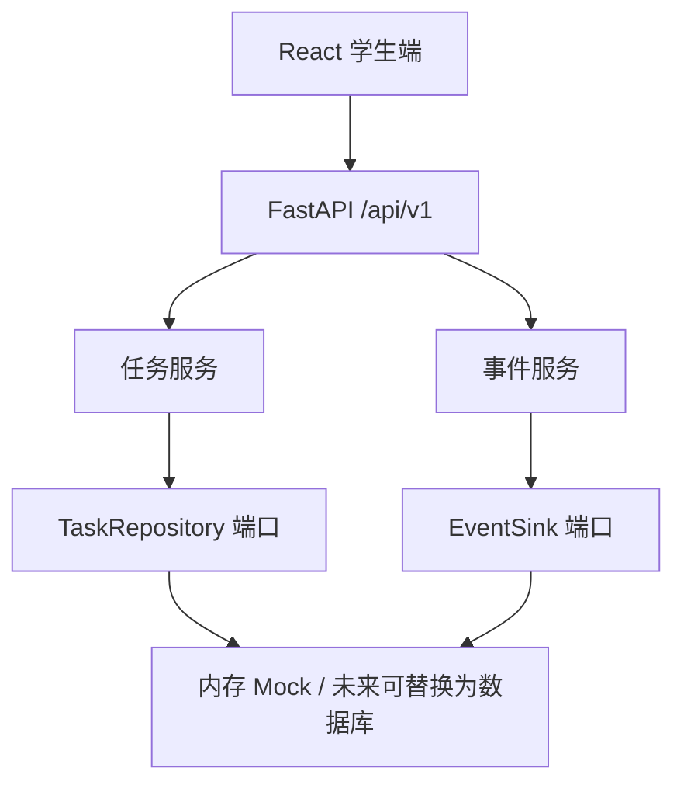
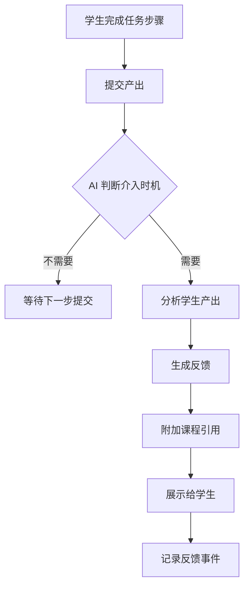

# D-008 任务引擎设计方案

> 文档编号：D-008
> 版本：v1.0
> 更新日期：2026-08-10
> 负责人：角色 E（任务引擎与产品）
> 状态：已确认

---

## 一、文档概述

本文档定义《计算机网络》AI 助教系统中**教学任务引擎**的完整设计方案，包括任务模板结构、六类教学任务的详细设计、AI 反馈介入机制、学习行为事件记录，以及与前端 Demo 的对应关系。

**设计原则：**
- 任务数据完全由独立系统承载，不涉及 Canvas 平台
- 任务结构具备通用性，可扩展至其他课程
- AI 反馈在关键节点介入，而非替代学生思考
- 所有任务交互通过 LearningEvent 记录，支撑后续学习分析

---

## 二、系统架构

### 2.1 任务引擎在整体架构中的位置



### 2.2 任务引擎核心组件

| 组件 | 职责 | 当前实现 |
|---|---|---|
| TaskRepository | 任务模板的存储与查询 | `InMemoryTaskRepository` |
| EventSink | 学习行为事件的接收与持久化 | `InMemoryEventSink` |
| TaskWorkspace（前端） | 任务列表、详情、进度展示 | React 组件 |
| ChatPanel（前端） | 问答交互，可触发任务关联 | React 组件 |

---

## 三、任务数据模型

### 3.1 TaskTemplate 核心字段

| 字段 | 类型 | 说明 | 示例 |
|---|---|---|---|
| `task_id` | string | 任务唯一标识 | `task-protocol-tcp-handshake` |
| `title` | string | 任务标题 | `Wireshark 分析 TCP 三次握手` |
| `description` | string | 任务描述 | `从抓包中定位 SYN、SYN-ACK 与 ACK` |
| `task_type` | TaskType | 六类任务类型之一 | `protocol_analysis` |
| `knowledge_point_ids` | list[string] | 关联知识点 ID | `["kp-transport-tcp-handshake"]` |
| `resource_ids` | list[string] | 所需课程资料 | `["resource-cn-textbook-001"]` |
| `prerequisite_ids` | list[string] | 前置知识点 ID | `["kp-transport-udp"]` |
| `completion_criteria` | list[string] | 完成判据 | `["标注三类报文并解释序列号变化"]` |
| `ai_feedback_points` | list[string] | AI 反馈触发节点 | `["提交报文编号后检查握手顺序"]` |
| `status` | TaskStatus | 任务状态 | `published` |

### 3.2 辅助数据模型

**LearningEvent（学习行为事件）：**

| 字段 | 类型 | 说明 |
|---|---|---|
| `event_id` | string | 事件唯一标识 |
| `course_id` | string | 课程 ID |
| `user_id` | string | 用户 ID |
| `event_type` | EventType | 事件类型（qa_asked / task_opened / task_completed / feedback_submitted） |
| `object_id` | string | 关联对象 ID（任务 ID 或问答请求 ID） |
| `occurred_at` | datetime | 发生时间 |
| `payload` | dict | 附加数据（答题内容、耗时等） |

---

## 四、六类教学任务详细设计

### 4.1 任务类型总览

| 编号 | 类型 | 英文标识 | 教学目标 | 典型场景 |
|---|---|---|---|---|
| T1 | 基础学习 | `foundation` | 掌握核心概念与原理 | 概念理解、知识自测 |
| T2 | 协议分析与仿真 | `protocol_analysis` | 通过抓包/仿真理解协议行为 | Wireshark 实验、协议交互分析 |
| T3 | 案例分析 | `case_study` | 运用知识分析真实场景 | 拥塞控制算法对比、CDN 架构分析 |
| T4 | 创新挑战 | `innovation_challenge` | 面向开放问题提出方案 | 边缘计算负载均衡、新型协议设计 |
| T5 | 项目实践 | `project_practice` | 综合运用完成项目 | 网络拓扑设计、协议选型与配置 |
| T6 | 排错 | `troubleshooting` | 培养故障诊断与修复能力 | DNS 解析异常、TCP 连接超时排查 |

---

### 4.2 T1 — 基础学习任务（Foundation）

**教学目标：** 帮助学生系统掌握课程核心概念、原理和基础知识点，建立知识体系框架。

**任务特征：**
- 围绕单个或少量知识点设计
- 有明确的正确答案
- 强调概念理解和原理复述
- 适合作为其他任务的前置条件

**典型任务流：**
```
阅读资料 → 理解概念 → 完成自测 → AI 校验 → 提示回顾薄弱点
```

**关联知识点示例：** IP 地址分类、子网划分、OSI 模型层次

**AI 反馈触发节点：**
1. 学生提交自测答案后 → 校验正确性，指出错误选项对应哪部分知识
2. 学生请求概念解释时 → 提供课本对应章节引用
3. 连续多次答错同一知识点 → 推荐补充阅读材料和低阶练习

**Demo 示例任务：**
- 任务名：网络层寻址路径学习
- 完成判据：完成知识点自测并解释最长前缀匹配
- AI 反馈：自测错误时提示回看对应章节

---

### 4.3 T2 — 协议分析与仿真任务（Protocol Analysis & Simulation）

**教学目标：** 通过抓包工具（如 Wireshark）或仿真环境，观察和分析网络协议的交互过程。

**任务特征：**
- 依赖实验工具和抓包数据
- 需要学生动手操作并截图/记录
- 强调"观察 → 验证 → 解释"的思维链
- 与实验指导书紧密关联

**典型任务流：**
```
阅读实验指导 → 搭建环境 → 执行抓包/仿真 → 标注关键报文 → 
提交分析结果 → AI 检查协议交互顺序 → 反馈遗漏或错误
```

**关联知识点示例：** TCP 三次握手、DNS 查询过程、HTTP 请求-响应

**AI 反馈触发节点：**
1. 学生提交报文分析后 → 检查协议状态机转换是否正确
2. 学生标注序列号/确认号后 → 验证数值逻辑
3. 学生描述协议交互流程后 → 指出遗漏的关键步骤

**Demo 示例任务：**
- 任务名：Wireshark 分析 TCP 三次握手
- 完成判据：标注 SYN、SYN-ACK、ACK 三类报文并解释序列号变化
- AI 反馈：提交报文编号后检查握手顺序

---

### 4.4 T3 — 案例分析任务（Case Study）

**教学目标：** 运用网络原理分析真实世界或工业界的网络案例，培养知识迁移能力。

**任务特征：**
- 基于真实场景或工业案例
- 多角度分析（性能、安全、架构）
- 需要对比和权衡
- 答案具备开放性但应有论据支撑

**典型任务流：**
```
阅读案例背景 → 识别关键问题 → 运用知识点分析 → 
提出观点 → AI 检验论据充分性 → 补充遗漏维度
```

**关联知识点示例：** TCP 拥塞控制（Reno vs BBR）、HTTP/2 vs HTTP/3

**AI 反馈触发节点：**
1. 学生提交分析报告后 → 检查是否覆盖关键维度
2. 学生对比方案后 → 提示遗漏的评估指标
3. 学生完成初稿后 → 追问边界条件

**Demo 示例任务：**
- 任务名：Reno 与 BBR 拥塞控制案例
- 完成判据：给出两种算法在目标与信号上的差异
- AI 反馈：比较表缺项时提示从控制信号补充

---

### 4.5 T4 — 创新挑战任务（Innovation Challenge）

**教学目标：** 面向开放性问题提出创新解决方案，培养设计思维和工程创新能力。

**任务特征：**
- 问题开放，无唯一标准答案
- 需要综合多章节知识
- 强调设计方案和权衡分析
- 可涉及前沿技术方向

**典型任务流：**
```
理解挑战背景 → 研究现有方案局限 → 提出设计思路 → 
绘制架构图 → AI 提出质疑和边界场景 → 迭代改进
```

**关联知识点示例：** 负载均衡、边缘计算、SDN

**AI 反馈触发节点：**
1. 学生提交方案后 → 追问极端场景和故障模式
2. 学生给出架构后 → 检查单点故障和可扩展性
3. 学生完成设计后 → 提示未考虑的约束条件

**Demo 示例任务：**
- 任务名：边缘计算负载均衡挑战
- 完成判据：提交含架构图、关键指标和权衡说明的方案
- AI 反馈：在选择策略后追问故障场景

---

### 4.6 T5 — 项目实践任务（Project Practice）

**教学目标：** 综合运用网络知识完成一个完整的工程设计项目。

**任务特征：**
- 综合性最强，涉及多章节知识
- 有明确的交付物要求（拓扑图、地址规划、配置方案）
- 模拟真实工程场景
- 需要多步骤完成

**典型任务流：**
```
分析需求 → 设计拓扑 → 规划地址 → 选择协议 → 
配置设备 → AI 检查一致性 → 检测潜在问题 → 提交完整方案
```

**关联知识点示例：** IP 编址、路由协议、VLAN、NAT、防火墙

**AI 反馈触发节点：**
1. 学生提交拓扑图后 → 检测单点故障
2. 学生规划地址后 → 检查地址冲突和子网合理性
3. 学生选型协议后 → 提示与需求的匹配度
4. 学生完成全部设计后 → 给出整体评审

**Demo 示例任务：**
- 任务名：智能家居网络设计
- 完成判据：提交拓扑图、地址规划和安全边界
- AI 反馈：检测单点故障与地址冲突

---

### 4.7 T6 — 排错任务（Troubleshooting）

**教学目标：** 基于故障现象和诊断信息，定位问题根因并提出修复方案。

**任务特征：**
- 给出故障现象或异常日志/抓包
- 需要分步骤排查
- 每步排查需要判断"证据是否充分"
- 最终给出根因、证据和修复步骤

**典型任务流：**
```
阅读故障描述 → 分析抓包/日志 → 提出假设 → 
逐层排查 → AI 评估每步证据充分性 → 确认根因 → 给出修复方案
```

**关联知识点示例：** DNS 解析流程、TCP 状态机、ICMP 差错报告

**AI 反馈触发节点：**
1. 学生每完成一个排查步骤 → 评估证据是否充分支持结论
2. 学生提出根因假设 → 检查是否覆盖所有观察到的现象
3. 学生给出修复方案 → 验证修复是否引入新问题

**Demo 示例任务：**
- 任务名：DNS 解析异常排错
- 完成判据：给出故障根因、证据和修复步骤
- AI 反馈：每完成一个排查步骤后反馈证据充分性

---

## 五、AI 反馈机制设计

### 5.1 反馈原则

1. **适时介入，不替代思考：** 在学生完成阶段性产出后介入，而非每步实时干预
2. **引导式提问：** 以"你考虑过 X 场景吗？"替代"你应该这样做"
3. **可追溯引用：** 反馈内容引用课程资料的具体章节，便于学生查证
4. **正面+建设性：** 先肯定正确部分，再指出改进方向

### 5.2 反馈触发节点总结

| 节点类型 | 触发条件 | 反馈内容 | 适用任务类型 |
|---|---|---|---|
| 提交校验 | 学生提交答案/分析 | 正确性检查、遗漏项提示 | T1, T2 |
| 维度检查 | 学生完成对比/分析 | 补充未覆盖的评估维度 | T3 |
| 场景追问 | 学生给出设计方案 | 追问边界条件和故障场景 | T4 |
| 一致性检测 | 学生提交多组件方案 | 检测组件间冲突 | T5 |
| 证据评估 | 学生完成排查步骤 | 评估推理链充分性 | T6 |
| 薄弱点推荐 | 多次答错同知识点 | 推荐补充材料 | T1 |

### 5.3 反馈流程



---

## 六、学习行为事件记录

### 6.1 事件类型

| 事件类型 | 触发时机 | 记录内容 |
|---|---|---|
| `qa_asked` | 学生提交问答 | question, course_id, timestamp |
| `task_opened` | 学生打开任务详情 | task_id, task_type |
| `task_completed` | 学生满足完成判据 | task_id, completion_time, attempts |
| `feedback_submitted` | 学生对 AI 回答给出评价 | request_id, rating, comment |

### 6.2 事件用途

- **学习分析：** 统计任务完成率、平均耗时、常见卡点
- **评测支撑：** 为角色 C 的评测集提供真实交互数据
- **知识库优化：** 识别高频问题，补充薄弱知识点的语料

---

## 七、前端 Demo 设计

### 7.1 界面结构

```
┌──────────────────────────────────────────────┐
│  Header: 计算机网络 AI 助教                    │
│  SystemStatus: API 连接状态                    │
├─────────────────────┬────────────────────────┤
│  ChatPanel          │  TaskWorkspace          │
│  ┌───────────────┐  │  ┌──────────────────┐  │
│  │ 问题输入框     │  │  │ 任务类型标签列表  │  │
│  │ 提交按钮       │  │  │ ┌────┐┌────┐    │  │
│  └───────────────┘  │  │ │基础││协议│... │  │
│  ┌───────────────┐  │  │ └────┘└────┘    │  │
│  │ 回答内容       │  │  └──────────────────┘  │
│  │ 置信度: 92%    │  │  ┌──────────────────┐  │
│  │ 引用来源:       │  │  │ 任务详情         │  │
│  │  - 第2章 p68   │  │  │ - 关联知识点     │  │
│  │  - 第3章 p214  │  │  │ - 关联资料       │  │
│  └───────────────┘  │  │ - 完成判据       │  │
│                     │  │ - AI反馈介入点   │  │
│                     │  └──────────────────┘  │
├─────────────────────┴────────────────────────┤
│  Footer: 离线 Mock · 独立系统 · v0.1          │
└──────────────────────────────────────────────┘
```

### 7.2 组件树

```
App
├── SystemStatus          // API 连通性指示
├── ChatPanel             // 问答面板
│   ├── QuestionForm      // 问题输入
│   ├── AnswerDisplay     // 回答展示
│   └── CitationList      // 引用列表
└── TaskWorkspace         // 任务工作台
    ├── TaskList          // 任务卡片列表
    │   └── TaskCard[]    // 单个任务卡片
    └── TaskDetail        // 任务详情
        ├── KnowledgePoints
        ├── Resources
        ├── CompletionCriteria
        └── AIFeedbackPoints
```

### 7.3 用户交互流程

**场景 1：课程问答**
```
打开页面 → 输入问题 → 点击"提问" → 显示加载状态 → 
展示回答 + 置信度 + 引用来源 → 可点击引用跳转资料位置
```

**场景 2：浏览教学任务**
```
打开页面 → 右侧显示六类任务列表 → 点击任务卡片 → 
左侧展示任务详情（知识点、资料、完成判据、AI反馈点）
```

**场景 3：任务驱动学习**（扩展方向）
```
阅读任务 → 在问答面板中提问相关知识点 → 
根据 AI 反馈调整理解 → 完成判据自检 → 标记任务完成
```

---

## 八、当前实现状态

### 8.1 已完成（骨架提供）

| 组件 | 文件 | 状态 |
|---|---|---|
| `TaskTemplate` 数据模型 | `apps/api/app/domain/models.py` | ✅ 已实现 |
| `TaskType` 六类枚举 | `apps/api/app/domain/enums.py` | ✅ 已实现 |
| `TaskStatus` 状态枚举 | `apps/api/app/domain/enums.py` | ✅ 已实现 |
| `TaskRepository` 端口 | `apps/api/app/services/ports.py` | ✅ 已实现 |
| `InMemoryTaskRepository` | `apps/api/app/adapters/mock.py` | ✅ 已实现 |
| `GET /api/v1/tasks` 路由 | `apps/api/app/api/routes/tasks.py` | ✅ 已实现 |
| `GET /api/v1/tasks/{id}` 路由 | `apps/api/app/api/routes/tasks.py` | ✅ 已实现 |
| `TaskWorkspace` 前端组件 | `apps/web/src/features/TaskWorkspace.tsx` | ✅ 已实现 |
| `ChatPanel` 前端组件 | `apps/web/src/features/ChatPanel.tsx` | ✅ 已实现 |
| `SystemStatus` 前端组件 | `apps/web/src/components/SystemStatus.tsx` | ✅ 已实现 |
| `LearningEvent` 模型与路由 | `apps/api/app/domain/models.py` + `routes/events.py` | ✅ 已实现 |
| Mock 六类任务示例数据 | `apps/api/app/adapters/mock.py` | ✅ 已实现 |
| 任务模板 JSON Schema | `contracts/schemas/TaskTemplate.json` | ✅ 已实现 |

### 8.2 待扩展（后续迭代）

| 功能 | 说明 | 优先级 |
|---|---|---|
| 任务进度追踪 | 记录学生在每个任务上的进度状态 | 中 |
| 任务完成自动判定 | 基于判据自动检测完成情况 | 中 |
| AI 反馈对话化 | 将反馈嵌入问答对话流 | 高 |
| 任务与问答联动 | 在任务上下文中提问，自动关联知识点 | 高 |
| 学习仪表盘 | 可视化展示学习进度和薄弱点 | 低 |

---

## 九、接口规范

### 9.1 任务相关 API

| 方法 | 路径 | 说明 |
|---|---|---|
| `GET` | `/api/v1/tasks` | 获取全部任务模板列表 |
| `GET` | `/api/v1/tasks/{task_id}` | 获取单个任务模板详情 |
| `POST` | `/api/v1/events` | 记录学习行为事件 |

### 9.2 任务模板 JSON Schema

详见 `contracts/schemas/TaskTemplate.json` 和 `contracts/examples/task-template.json`。

当前 Mock 数据包含全部六类任务的示例，每类 1 个，共 6 个任务模板。Mock 数据涵盖教材《计算机网络：自顶向下方法》第 2-5 章的核心知识点。

---

## 十、与 Demo 交付（D-010）的关系

D-010 的交付内容包括：
1. **Demo 代码：** 当前 `apps/web/` 下的完整前端代码，以及 `apps/api/` 下的后端 API
2. **运行说明：** 按 `README.md` 中的快速开始步骤即可启动
3. **截图：** 启动后访问 `http://127.0.0.1:5173` 可截取以下界面：
   - 系统主页（含问答面板和任务工作台）
   - 提问后展示回答、置信度和引用来源
   - 六类任务卡片的列表与详情切换
   - API 健康检查与文档页

---

## 附录：Demo 六类任务数据一览

| task_id | 任务名 | 类型 | 关联知识点 | 核心判据 |
|---|---|---|---|---|
| `task-foundation-addressing` | 网络层寻址路径学习 | 基础学习 | kp-network-addressing | 完成自测并解释最长前缀匹配 |
| `task-protocol-tcp-handshake` | Wireshark 分析 TCP 三次握手 | 协议分析 | kp-transport-tcp-handshake | 标注三类报文并解释序列号变化 |
| `task-case-congestion` | Reno 与 BBR 拥塞控制案例 | 案例分析 | kp-transport-congestion-control | 给出两种算法差异 |
| `task-innovation-edge` | 边缘计算负载均衡挑战 | 创新挑战 | kp-application-load-balancing | 提交架构图、指标和权衡说明 |
| `task-project-smart-home` | 智能家居网络设计 | 项目实践 | kp-network-design | 提交拓扑、地址规划和安全边界 |
| `task-troubleshooting-dns` | DNS 解析异常排错 | 排错 | kp-application-dns | 给出根因、证据和修复步骤 |
