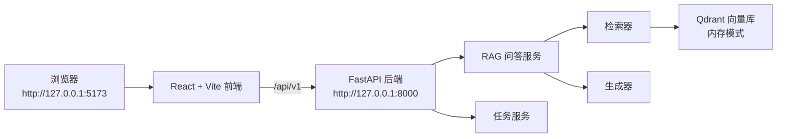

# D-010 Demo 代码、截图与运行说明

> 文档编号：D-010
> 版本：v1.0
> 更新日期：2026-08-16
> 负责人：角色 E（任务引擎与产品）｜角色 D（RAG 与模型技术）
> 状态：已验收

---

## 一、交付物概述

本 Demo 是《计算机网络》课程 AI 助教原型的最小可运行版本，完整演示：

1. **带引用的课程问答**：输入问题 → 检索课程资料 → 生成回答 → 展示可追溯引用（来源、章节、页码）
2. **六类教学任务**：浏览任务卡片 → 查看任务详情（关联知识点、资料、完成判据、AI 反馈介入点）
3. **系统状态感知**：前端实时显示 API 连接状态与运行模式

Demo 完全离线、独立运行，不依赖 Canvas、真实模型服务或付费 API。

---

## 二、Demo 架构



| 层 | 技术 | 说明 |
|---|---|---|
| 前端 | React 18 + TypeScript + Vite | 学生端工作台 |
| 后端 | FastAPI + Pydantic | REST API + 数据校验 |
| 检索 | Qdrant（内存模式） | 向量检索 + 元数据过滤 |
| 生成 | 离线抽取式生成器 | 基于证据 Chunk 生成回答 |
| 引用 | CitationAssembler | 按句挂角标，来源可追溯 |

---

## 三、环境准备

### 3.1 版本要求

| 依赖 | 最低版本 | 验证命令 |
|---|---|---|
| Python | 3.11+ | `python --version` |
| Node.js | 22+ | `node --version` |
| npm | 10+ | `npm --version` |

### 3.2 安装步骤

> ⚠️ 推荐使用 **Git Bash** 或 **CMD**，不要用 PowerShell（会触发脚本执行策略限制）。

**第一步：克隆仓库并切换到 dev 分支**

```bash
git clone https://github.com/pyz2190/cn-course-ai-assistant.git
cd cn-course-ai-assistant
git checkout dev
```

**第二步：创建 Python 虚拟环境并安装后端依赖**

```bash
python -m venv .venv
source .venv/Scripts/activate        # Windows Git Bash
# macOS/Linux 用：source .venv/bin/activate

# 若 pip 下载慢，加清华镜像
python -m pip install -e "apps/api[dev]" -i https://pypi.tuna.tsinghua.edu.cn/simple
```

**第三步：安装前端依赖**

```bash
npm install
```

**第四步：生成契约（OpenAPI + 前端类型）**

```bash
npm run contracts
```

---

## 四、启动 Demo

### 4.1 一键启动（推荐）

```bash
npm run dev
```

该命令同时启动：
- 前端：`http://127.0.0.1:5173`
- 后端：`http://127.0.0.1:8000`

### 4.2 分别启动（调试用）

```bash
# 终端 1：启动后端
source .venv/Scripts/activate
npm run dev:api

# 终端 2：启动前端
npm run dev:web
```

### 4.3 启动成功标志

看到以下输出即成功：

```
[api] INFO:     Uvicorn running on http://127.0.0.1:8000
[web] Local:   http://127.0.0.1:5173/
```

---

## 五、界面功能说明

### 5.1 页面总览

打开浏览器访问 `http://127.0.0.1:5173`，页面分为三个区域：

| 区域 | 组件 | 功能 |
|---|---|---|
| 顶部 Hero | SystemStatus | 显示 API 连接状态（在线/离线/连接中） |
| 左侧面板 | ChatPanel | 课程问答：输入问题、显示回答、置信度、引用来源 |
| 右侧面板 | TaskWorkspace | 六类教学任务：任务卡片列表 + 任务详情 |

### 5.2 问答面板（ChatPanel）

**操作流程：**
1. 在输入框输入问题（默认已有示例问题"TCP 为什么需要三次握手？"）
2. 点击"提问"按钮
3. 查看生成的回答、置信度百分比、引用来源列表

**引用来源包含：** 资料标题、章节、页码范围、原文摘录

### 5.3 任务工作台（TaskWorkspace）

**六类任务：**

| 任务类型 | 任务示例 |
|---|---|
| 基础学习 | 网络层寻址路径学习 |
| 协议分析与仿真 | Wireshark 分析 TCP 三次握手 |
| 案例分析 | Reno 与 BBR 拥塞控制案例 |
| 创新挑战 | 边缘计算负载均衡挑战 |
| 项目实践 | 智能家居网络设计 |
| 排错 | DNS 解析异常排错 |

**操作流程：**
1. 点击左侧任务卡片
2. 右侧展示任务详情：关联知识点、关联资料、完成判据、AI 反馈介入点

---

## 六、截图指引

以下是验收需要提交的截图清单，共 **10 张**。请按顺序逐张截图。

### 截图 1：系统主页总览

**操作：** 启动后直接打开 `http://127.0.0.1:5173`
**要点：**
- 完整页面（Hero + 状态指示 + 左右两个面板）
- 右上角显示 "API 已连接 · Mock 模式"（绿色圆点）
- 显示"开发基线"提示条

### 截图 2：提问成功（带引用回答）

**操作：** 在问答面板点击"提问"按钮（使用默认问题或输入新问题）
**要点：**
- 回答区域显示"模拟回答"标签
- 置信度百分比（如"置信度 92%"）
- 引用来源列表，包含 `[1]` 角标、资料标题、章节、页码

### 截图 3：六类任务卡片列表

**操作：** 将目光聚焦右侧任务工作台
**要点：**
- 6 个任务卡片全部可见
- 每个卡片显示任务类型标签 + 任务标题
- 顶部显示任务数量徽章

### 截图 4：任务详情（基础学习类）

**操作：** 点击"网络层寻址路径学习"任务卡片
**要点：**
- 右侧深色面板显示任务详情
- 可见：关联知识点、关联资料、完成判据、AI 反馈介入点四个列表

### 截图 5：任务详情（协议分析类）

**操作：** 点击"Wireshark 分析 TCP 三次握手"任务卡片
**要点：**
- 显示该任务的完整详情
- 完成判据："标注三类报文并解释序列号变化"
- AI 反馈介入点："提交报文编号后检查握手顺序"

### 截图 6：API 健康检查

**操作：** 浏览器打开 `http://127.0.0.1:8000/api/v1/health`
**要点：**
- 显示 JSON 响应：`status`、`service`、`mode` 字段

### 截图 7：API 交互式文档（Swagger UI）

**操作：** 浏览器打开 `http://127.0.0.1:8000/docs`
**要点：**
- FastAPI 自动生成的 Swagger 文档
- 可见所有 API 端点（health、resources、qa、tasks、events）

### 截图 8：后端启动日志

**操作：** 切换到运行 `npm run dev` 的终端
**要点：**
- 显示 Uvicorn 启动日志
- 显示前端 Vite 启动日志
- 两个服务都正常运行

### 截图 9：测试通过结果

**操作：** 运行 `npm run test`
**要点：**
- API 测试全部通过（pytest）
- Web 测试全部通过（vitest）

### 截图 10：契约与构建检查（可选加分项）

**操作：** 运行 `npm run check`
**要点：**
- 显示全部检查通过（lint、typecheck、build、contracts）

---

## 七、常见问题排查

### 7.1 PowerShell 报"禁止运行脚本"

**现象：**
```
npm : 无法加载文件 D:\Nodejs\npm.ps1，因为在此系统上禁止运行脚本
```

**解决：** 改用 Git Bash 或 CMD 运行，或执行：
```powershell
Set-ExecutionPolicy -ExecutionPolicy RemoteSigned -Scope CurrentUser
```

### 7.2 pip 安装超时

**现象：** `Connection to pypi.org timed out`

**解决：** 使用国内镜像：
```bash
pip install -e "apps/api[dev]" -i https://pypi.tuna.tsinghua.edu.cn/simple
```

### 7.3 前端显示"API 未连接"

**现象：** 页面右上角红色圆点，显示"API 未连接"

**解决：**
1. 确认后端已启动（检查 8000 端口）
2. 确认 `.env` 中 `VITE_API_BASE_URL` 为空（使用默认代理）
3. 重启 `npm run dev`

### 7.4 端口被占用

**现象：** 启动时报 `port 8000 already in use`

**解决：**
```bash
# Windows 查看占用进程
netstat -ano | findstr :8000
# 结束对应进程后重启
```

---

## 八、验收对照

| 验收项 | 要求 | 对应截图 |
|---|---|---|
| 问答接口返回带引用回答 | answer + citations + confidence | 截图 2 |
| 引用含资源、章节、页码 | Citation 字段完整 | 截图 2 |
| 六类任务均可读取 | 6 个任务卡片 | 截图 3、4、5 |
| 任务详情含四要素 | 知识点/资料/判据/反馈点 | 截图 4、5 |
| 系统状态可感知 | SystemStatus 组件 | 截图 1 |
| API 健康检查可调用 | health 端点 | 截图 6 |
| 完全离线可运行 | 无外部依赖 | 截图 8 |
| 测试全部通过 | pytest + vitest | 截图 9 |

---

## 九、Demo 代码清单

| 文件 | 说明 | 负责人 |
|---|---|---|
| `apps/web/src/App.tsx` | 页面主框架 | E |
| `apps/web/src/features/ChatPanel.tsx` | 问答面板 | E |
| `apps/web/src/features/TaskWorkspace.tsx` | 任务工作台 | E |
| `apps/web/src/components/CitationList.tsx` | 引用列表 | E |
| `apps/web/src/components/SystemStatus.tsx` | 状态指示 | E |
| `apps/web/src/api/client.ts` | API 客户端 | E |
| `apps/api/app/adapters/rag/` | RAG 检索-生成适配器 | D |
| `apps/api/app/services/rag.py` | RAG 服务编排 | D |
| `apps/api/app/services/qa.py` | 问答服务 | D |
| `apps/api/app/adapters/mock.py` | Mock 数据（离线回退） | B/D/E |

---

## 十、补充说明

1. **两种运行模式：** Demo 默认运行在离线模式（Qdrant 内存 + 确定性离线 Embedding + 抽取式生成），无需密钥、网络或模型下载。切换到外部模式（BGE + OpenAI-compatible）需额外配置 `.env`，详见 D-004。

2. **Mock 与 RAG 的关系：** 骨架阶段的 Mock 适配器用于前后端联调；D 的 RAG 后端提供真实检索-生成链路。两者通过端口（Protocol）隔离，接口契约完全一致。

3. **不包含的内容：** 本 Demo 不接入 Canvas API/LTI，不实现生产级登录、权限管理，不包含真实 PDF/PPT 解析流水线。
