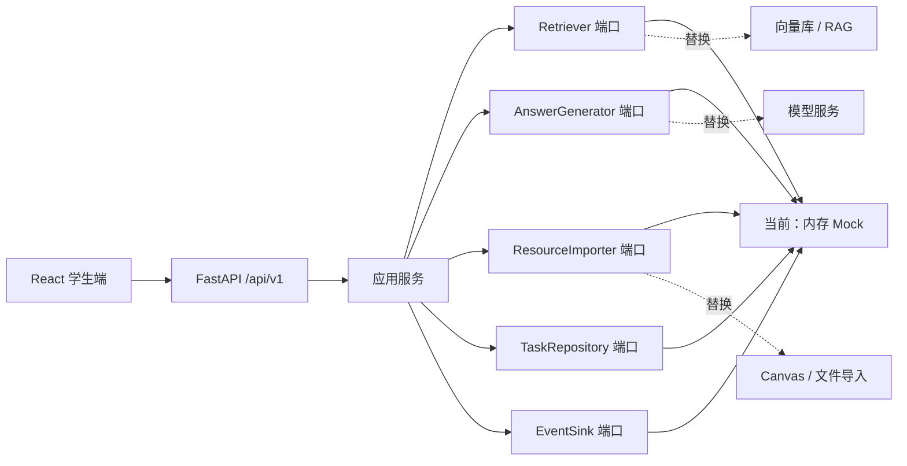

# 架构与扩展点

## 总体结构

后端遵循“领域模型 → 应用服务 → 端口 → 适配器”依赖方向。业务代码只依赖抽象端口，因此 B、D、E 可以分别替换语料、RAG 和任务实现，而不阻塞前端联调。

## 核心契约

所有稳定类型在 `apps/api/app/domain/` 定义，包含：

- `ChunkMetadata`：课程、资源、章节、页码、时间码、语言与访问级别
- `Citation`：回答中的来源引用
- `AskRequest` / `AskResponse`：问答协议
- `TaskTemplate`：六类教学任务模板
- `LearningEvent`：学习行为事件
- `EvaluationItem`：评测样本和评分维度

运行 `npm run contracts` 会输出：

- `contracts/openapi.json`
- `contracts/schemas/*.json`
- `apps/web/src/api/schema.d.ts`

生成文件必须与领域模型一起提交，CI 会检查契约漂移。

## API 边界

| 方法 | 路径 | 用途 | 主要负责人 |
|---|---|---|---|
| GET | `/api/v1/health` | 前后端联通和运行模式 | A |
| POST | `/api/v1/resources/import` | 提交课程资料导入 | B / D |
| POST | `/api/v1/qa/ask` | 检索、生成并返回引用 | D |
| GET | `/api/v1/tasks` | 获取教学任务模板 | E |
| GET | `/api/v1/tasks/{task_id}` | 获取单个任务模板 | E |
| POST | `/api/v1/events` | 记录学习行为 | E / C |

## Canvas 边界

当前没有已确认的同济 Canvas API、LTI、课程导出或 AI 能力，因此系统不依赖 Canvas 登录态或内部接口。未来接入时：

1. 在 `adapters/` 新建 Canvas 适配器。
2. 把 Canvas 字段转换为 `ChunkMetadata` 和资源导入请求。
3. 保持现有 API 与前端类型不变。
4. 未确认的权限、接口和限流规则必须记录为阻塞项，不能以假数据冒充可用能力。
