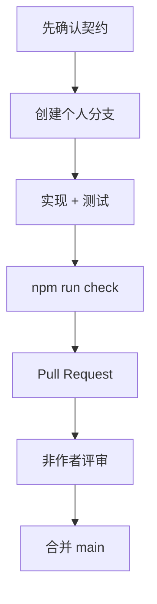

# 五人协作规范

## 单一事实来源

- 产品范围与运行说明：`README.md`
- 技术方案与扩展边界：`docs/architecture.md`
- 工作项与变更记录：GitHub Issue 与 Pull Request
- 验收入口：`npm run check` 与 GitHub Actions
- 接口协议：`contracts/openapi.json` 与 `contracts/schemas/`
- 组内决策：Pull Request、Issue 或飞书项目文档，不以聊天消息作为最终结论

## 并行开发

每位成员只修改自己负责的实现，并通过接口契约与其他模块对接。需要临时依赖他人能力时，先实现端口或 Mock，不等待完整模块落地。

## 分支与提交

- 功能：`feat/<角色>-<主题>`
- 修复：`fix/<主题>`
- 文档：`docs/<主题>`
- 提交信息使用英文动词开头，保持单一目的。
- 不在共享分支进行强制推送。
- 不提交 `.env`、账号、Cookie、模型密钥或课程受限资料。

## 联调规则

1. 前端以 `apps/web/src/api/schema.d.ts` 为类型来源。
2. 后端接口以 `/api/v1` 为固定前缀。
3. 所有错误返回稳定的 `code`、`message`、`request_id` 和 `details`。
4. 引用必须包含可追溯的资源、章节以及页码或时间码。
5. Mock 返回结构必须与真实适配器完全一致。
6. 发现阻塞时记录：负责人、影响范围、临时方案、下一次检查时间。

## 评审重点

- A：跨模块边界、配置、安全和可部署性
- B：元数据、切分质量、来源可追溯性
- C：测试覆盖、评测可复现性、回归风险
- D：检索、生成、引用和模型降级
- E：任务流程、交互状态和学习事件
